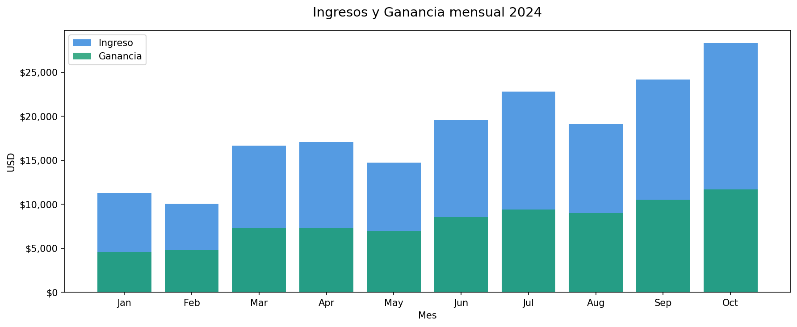
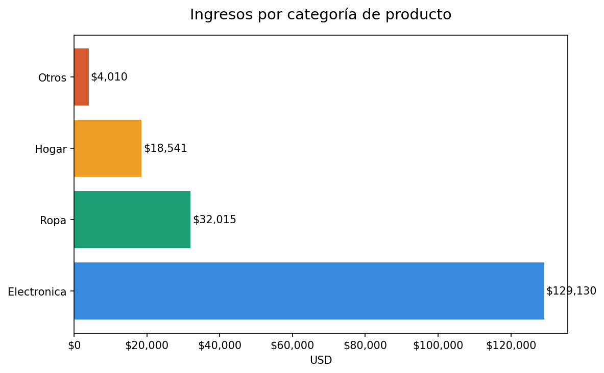
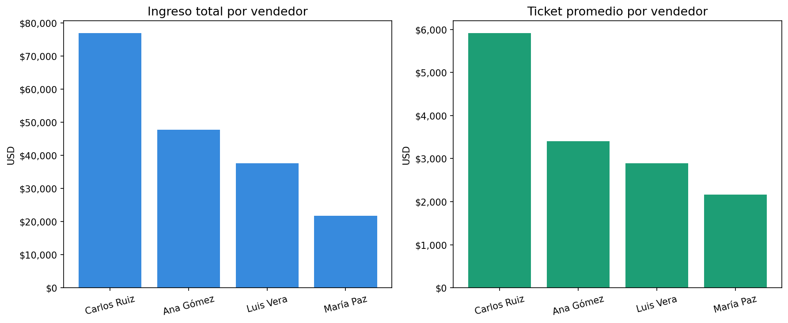
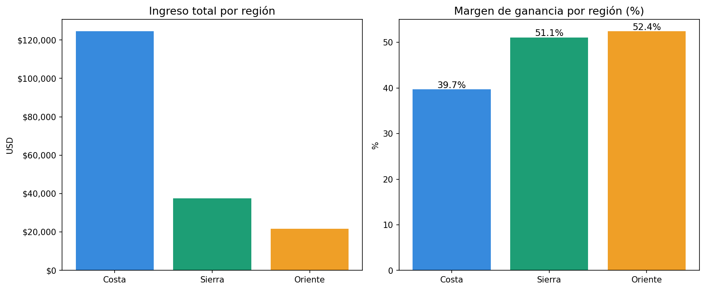

# Análisis de Ventas y CRM — Retail

## Descripción
Análisis exploratorio de datos de ventas de una empresa retail, enfocado en el rendimiento del embudo CRM, segmentación de clientes y tendencias de ingresos mensuales.

## Preguntas que responde este análisis
- ¿En qué meses se generan más ingresos y ganancias?
- ¿Qué categoría de producto es más rentable?
- ¿Qué vendedor tiene mejor rendimiento?
- ¿Qué región tiene mayor margen de ganancia?

## Herramientas utilizadas
- Python (Pandas, Matplotlib)
- SQL (SQLite)
- Google Colab
- GitHub

## Análisis realizados
### Python
- Tendencia de ingresos y ganancia mensual
- Ventas por categoría de producto
- Rendimiento por vendedor
- Ingresos y margen por región

### SQL
- Rentabilidad por categoría
- Ranking de vendedores por ingreso y margen
- Tendencia mensual de ventas
- Valor por segmento de cliente (Enterprise, Mid-market, SMB)

## Resultados principales

## Estructura del proyecto
- `data/` → Dataset de ventas 2024
- `notebooks/` → Análisis completo en Python
